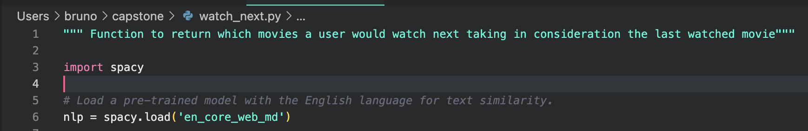
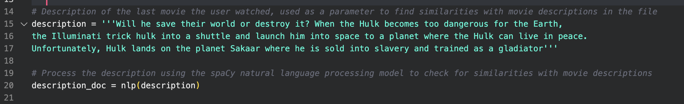
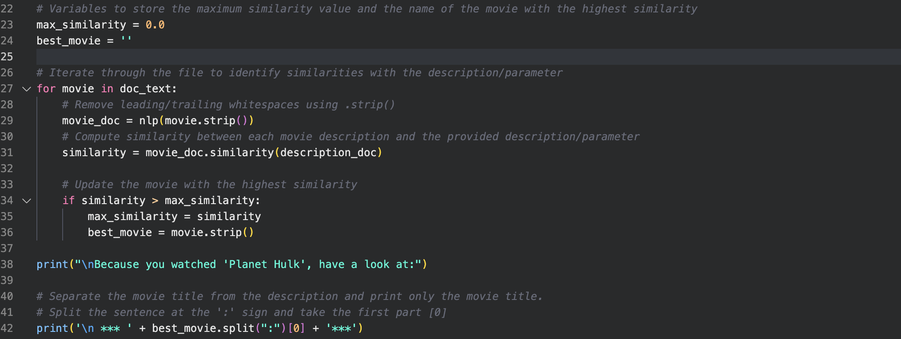

# Movie Recommendation System based on Similarity

"""This code implements a movie recommendation system that suggests which movies a user should watch next 
based on the description of the last movie they watched. It utilizes the spaCy natural language processing library 
to compute text similarity between the last watched movie's description and a collection of movie descriptions stored in a file."""

## Table of Contents

- [Requirements](#requirements)
- [Installation](#installation)
- [Usage](#usage)
- [Example](#example)
- [Contributing](#contributing)

### Requirements

Python 3.x
spaCy library
'en_core_web_md' spaCy model
### Installation

1- Clone the repository: git clone https://github.com/your_username/your_repository.git   

2- Install the required dependencies:
pip install spacy
python -m spacy download en_core_web_md

### Usage

1- Ensure that the movie titles and descriptions are stored in a text file named 'movies.txt' within the same directory as the Python script.

2- Open the Python script and modify the description variable with the description of the last movie you watched.

3- Run the script: python watch_next.py         

4- The script will compute the similarity between the last watched movie's description and each movie in the 'movies.txt' file. 
It will then recommend the movie with the highest similarity.

5- The recommended movie title will be displayed on the console.

### Example

Suppose the description of the last movie you watched is: 'Will he save their world or destroy it? When the Hulk becomes too dangerous for the Earth,
the Illuminati trick hulk into a shuttle and launch him into space to a planet where the Hulk can live in peace. Unfortunately, Hulk lands on 
the planet Sakaar where he is sold into slavery and trained as a gladiator.'

Based on this description, the script will recommend a movie from the 'movies.txt' file that has the highest similarity. The recommended movie title 
will be displayed on the console.

### Contributing

Contributions are welcome! If you have any suggestions, improvements, or bug fixes, please feel free to open an issue or submit a pull request.

